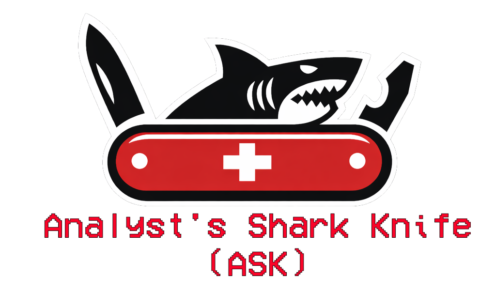

# ASK (Analyst's Shark Knife)

[](CHANGELOG.md)
[](CHANGELOG.md)
[](LICENSE)
[](https://www.wireshark.org/)
[](https://www.lua.org/)
[](installers/macos/)
[](installers/linux/)
[](installers/windows/)

A comprehensive Wireshark Lua plugin suite for security analytics and IOC (Indicators of Compromise) research. Provides real-time threat intelligence lookups directly from Wireshark's packet context menu.

> **✨ Version 0.2.1**: Enhanced installer with version checking and upgrade detection. Includes Scan Detector integration and improved JSON library installation.

> **⚠️ Important**: Some features require external tools (nmap, dig, openssl, traceroute) and API keys. Please review the [Feature Matrix](#-feature-matrix) and check your platform's [installer documentation](installers/) before installation to ensure all dependencies are available.

## ✨ Features

- 🔍 **DNS Registration Info (RDAP)** - Modern RDAP lookups, no API key required
- 🌐 **IP Registration Data (RDAP)** - ARIN/RIPE/APNIC/LACNIC/AFRINIC registration info, IPv4 & IPv6
- 🛡️ **IP Reputation** - AbuseIPDB and VirusTotal integration
- 🔍 **IP Intelligence** - Shodan, IPinfo, GreyNoise, AlienVault OTX, and Abuse.ch (URLhaus/ThreatFox) integration with VPN/Proxy/Tor detection and scanner identification
- 🔗 **URL Reputation** - urlscan.io sandbox analysis, VirusTotal scanning, AlienVault OTX threat intelligence, and URLhaus malware detection
- 🌐 **Domain Reputation** - VirusTotal and AlienVault OTX domain analysis
- 🔐 **TLS Certificate Analysis** - Direct certificate inspection and Certificate Transparency logs
- 🔒 **Certificate Validity Check** - Fast OpenSSL-based certificate validation
- 📧 **Email Analysis** - SMTP/IMF email address analysis
- 📊 **DNS Analytics** - Comprehensive DNS lookups (PTR, A, AAAA, MX, TXT, NS, SOA, CNAME)
- 🌐 **Network Diagnostics** - Ping and Traceroute tools
- 🔍 **Network Scanning** - Nmap integration (SYN scan, service scan, Vulners vulnerability scan)
- 🛡️ **Scan Detector** - Optional post-dissector plugin for real-time network scan detection (SYN, ACK, FIN, XMAS, NULL, UDP, ARP scans)

## 📸 Usage

Access the plugin from Wireshark's packet context menu:

```
Right-click on packet field → ASK → [Feature]
```

**Examples:**
- **IP address:** `IP Dest → ASK → IP Reputation (AbuseIPDB)`
- **DNS query:** `DNS → ASK → DNS Registration Info (RDAP)`
- **TLS Certificate:** `TLS → ASK → Certificate Analysis`
- **HTTP URL:** `HTTP → ASK → URL Reputation (urlscan.io)`

## 🚀 Quick Start

### Installation

#### macOS
```bash
# See detailed instructions: installers/macos/README.md
cd installers/macos
chmod +x install.sh
./install.sh
```

The installer will:
- Install `ask.lua` plugin
- Optionally install `scan_detector.lua` (Scan Detector plugin)
- Optionally install JSON library (if curl/wget available)
- Run API key setup script

#### Linux
```bash
# See detailed instructions: installers/linux/README.md
cd installers/linux
chmod +x install.sh
./install.sh
```

The installer will:
- Install `ask.lua` plugin
- Optionally install `scan_detector.lua` (Scan Detector plugin)
- Optionally install JSON library (if curl/wget available)
- Run API key setup script

#### Windows
**Windows users:** Please follow the **[Windows Installation Guide](installers/windows/README.md)** for detailed step-by-step instructions.

```powershell
# Run installer
cd installers\windows
.\install.ps1
```

The installer will:
- Install `ask.lua` plugin
- Optionally install `scan_detector.lua` (Scan Detector plugin)
- Optionally install JSON library (if curl/Invoke-WebRequest available)
- Run API key setup script

## 📊 Feature Matrix

| Feature | No Requirements | API Key Required | External Tool Required | Free Tier Limits |
|---------|----------------|------------------|----------------------|------------------|
| **DNS Registration Info (RDAP)** | ✅ | ❌ | ❌ | Unlimited |
| **IP Registration Info (RDAP)** | ✅ | ❌ | ❌ | Unlimited |
| **TLS Certificate Analysis** | ✅ | ❌ | ❌ | Unlimited |
| **Certificate Transparency** | ✅ | ❌ | ❌ | Unlimited |
| **Email Analysis** (basic) | ✅ | ❌ | ❌ | Unlimited |
| **IP Reputation (AbuseIPDB)** | ❌ | ✅ | ❌ | 1,000/day |
| **IP Reputation (VirusTotal)** | ❌ | ✅ | ❌ | 4/min, 500/day |
| **IP Intelligence (Shodan)** | ❌ | ✅ (Paid) | ❌ | Requires $49+ membership |
| **IP Intelligence (IPinfo)** | ❌ | ✅ | ❌ | 50,000/month (Lite) |
| **IP Intelligence (GreyNoise)** | ✅ | ❌ | ❌ | 50 searches/week |
| **IP Intelligence (AlienVault OTX)** | ❌ | ✅ | ❌ | Unlimited (free tier) |
| **URL Reputation (urlscan.io)** | ⚠️ Limited | ✅ Recommended | ❌ | 100 scans/day, 10K searches/day |
| **URL Reputation (VirusTotal)** | ❌ | ✅ | ❌ | 4/min, 500/day |
| **URL Intelligence (AlienVault OTX)** | ❌ | ✅ | ❌ | Unlimited (free tier) |
| **URL Intelligence (URLhaus)** | ❌ | ✅ | ❌ | Fair use (free tier) |
| **Host Intelligence (URLhaus)** | ❌ | ✅ | ❌ | Fair use (free tier) |
| **IOC Intelligence (ThreatFox)** | ❌ | ✅ | ❌ | Fair use (free tier) |
| **Domain Reputation (VirusTotal)** | ❌ | ✅ | ❌ | 4/min, 500/day |
| **Domain Intelligence (AlienVault OTX)** | ❌ | ✅ | ❌ | Unlimited (free tier) |
| **Certificate Validity Check** | ❌ | ❌ | ✅ openssl | N/A |
| **DNS Analytics** | ❌ | ❌ | ✅ dig | N/A |
| **Ping** | ❌ | ❌ | ✅ ping | N/A |
| **Traceroute** | ❌ | ❌ | ✅ traceroute | N/A |
| **Nmap Scans (SYN, Service, Vulners)** | ❌ | ❌ | ✅ nmap | N/A |
| **Scan Detector** (Optional Plugin) | ✅ | ❌ | ❌ | N/A |

### Legend
- ✅ **Works** - Feature is fully functional
- ⚠️ **Limited** - Feature works but with reduced functionality
- ❌ **Not Available** - Feature requires the listed requirement

## 🔑 API Key Registration & Free Tiers

### AbuseIPDB (Required for IP Reputation)
- **Registration:** https://www.abuseipdb.com/api
- **Free Tier:** 1,000 requests/day
- **What you get:** IP abuse confidence scores, total reports, distinct reporters, last reported date

### VirusTotal (Optional - Multiple Features)
- **Registration:** https://www.virustotal.com/gui/join-us
- **Free Tier:** 4 requests/minute, 500 requests/day
- **What you get:** 
  - IP reputation (70+ antivirus engines)
  - URL scanning and analysis
  - Domain reputation checking

### Shodan (Optional - IP Intelligence)
- **Registration:** https://account.shodan.io/register
- **Free Tier:** 100 queries/month (limited endpoints)
- **Paid Tier Required:** IP host lookups require $49 one-time minimum membership
- **What you get:** Comprehensive IP intelligence, open ports, services, banners, vulnerabilities

### IPinfo (Optional - IP Intelligence)
- **Registration:** https://ipinfo.io/signup
- **Free Tier:** 50,000 requests/month (Lite API - country/ASN only)
- **Paid Tiers:** Core/Plus/Business provide VPN/Proxy/Tor detection, hosting detection, abuse contacts
- **What you get:** 
  - Geolocation data
  - VPN/Proxy/Tor detection (paid tiers)
  - Hosting/datacenter detection
  - ASN information
  - Mobile carrier information (paid tiers)

### GreyNoise (Optional - IP Intelligence)
- **Registration:** Not required for Community API
- **Free Tier:** 50 searches per week (Community API - no API key needed)
- **What you get:** 
  - Internet scanner detection (identifies IPs scanning the internet)
  - RIOT dataset (legitimate business services)
  - IP classification (malicious, benign, unknown)
  - Reduces false positives from benign scanning activity
- **API:** https://api.greynoise.io/v3/community
- **Note:** No API key required for Community API. Perfect for identifying scanners vs legitimate services.

### urlscan.io (Optional - URL Analysis)
- **Registration:** https://urlscan.io/user/signup
- **Free Tier:** 100 scans/day, 10,000 searches/day
- **What you get:** 
  - Dynamic URL sandbox analysis
  - Security verdicts from multiple engines
  - Maliciousness scores
  - Resource analysis (domains, IPs, URLs contacted)

## 🛠️ External Tools

### Required Tools (for specific features)

| Tool | Feature(s) | Installation |
|------|-----------|--------------|
| **openssl** | Certificate Validity Check | macOS: `brew install openssl`<br>Linux: `apt-get install openssl`<br>Windows: [Download](https://slproweb.com/products/Win32OpenSSL.html) |
| **dig** | DNS Analytics | macOS: `brew install bind`<br>Linux: `apt-get install dnsutils`<br>Windows: Install BIND tools or use WSL |
| **ping** | Ping Host | Usually pre-installed |
| **traceroute** | Traceroute to Host | macOS: `brew install traceroute`<br>Linux: `apt-get install traceroute`<br>Windows: Pre-installed (tracert) |
| **nmap** | Network Scanning | macOS: `brew install nmap`<br>Linux: `apt-get install nmap`<br>Windows: [Download](https://nmap.org/download.html) |

## 📋 Requirements

### Core Requirements
- **Wireshark 4.2+** (for `register_packet_menu` support)
- **curl** (for HTTP requests to APIs)
- **Lua JSON library** (recommended) - See [INSTALL_JSON_LIBRARY.md](INSTALL_JSON_LIBRARY.md)

### Optional Requirements
- API keys for enhanced features (see [Feature Matrix](#-feature-matrix))
- External tools for specific features (see [External Tools](#️-external-tools))

## 📖 Documentation

- **[Quick Start Guide](QUICKSTART.md)** - Get up and running in 5 minutes
- **[Platform-Specific Installation](installers/)** - Detailed setup for macOS, Linux, Windows
- **[JSON Library Installation](INSTALL_JSON_LIBRARY.md)** - Improve JSON parsing performance
- **[Scan Detector Documentation](Scan_Detector/)** - Network scan detection plugin
- **[Changelog](CHANGELOG.md)** - Version history and changes

## 🔧 Configuration

API keys are stored in:
- **macOS/Linux:** `~/.ask/`
- **Windows:** `%USERPROFILE%\.ask\`

The plugin automatically checks both `~/.ask/` and `~/.ioc_researcher/` for backward compatibility.

Use the provided setup scripts:
- **macOS/Linux:** `./setup_api_keys.sh`
- **Windows:** `setup_api_keys.ps1` or `setup_api_keys.bat`

## 📝 License

This project is licensed under the GNU General Public License v2.0 - see the [LICENSE](LICENSE) file for details.

## 🤝 Contributing

Contributions are welcome! Please feel free to submit a Pull Request.

## 📧 Support

For issues, questions, or contributions, please use the GitHub Issues page.

## 🙏 Acknowledgments

- Wireshark team for the excellent packet analysis platform
- All API providers (AbuseIPDB, VirusTotal, Shodan, IPinfo, urlscan.io, AlienVault OTX, Abuse.ch) for their free tiers
- RDAP.org for providing free RDAP lookup services
- **rxi/json.lua** - Lightweight pure-Lua JSON library used for enhanced JSON parsing (MIT License) - https://github.com/rxi/json.lua
